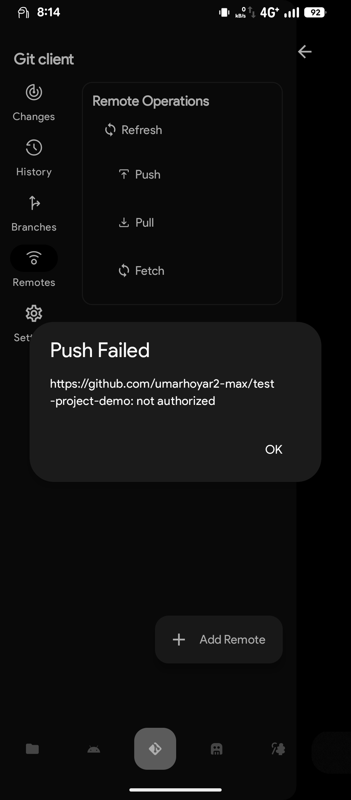
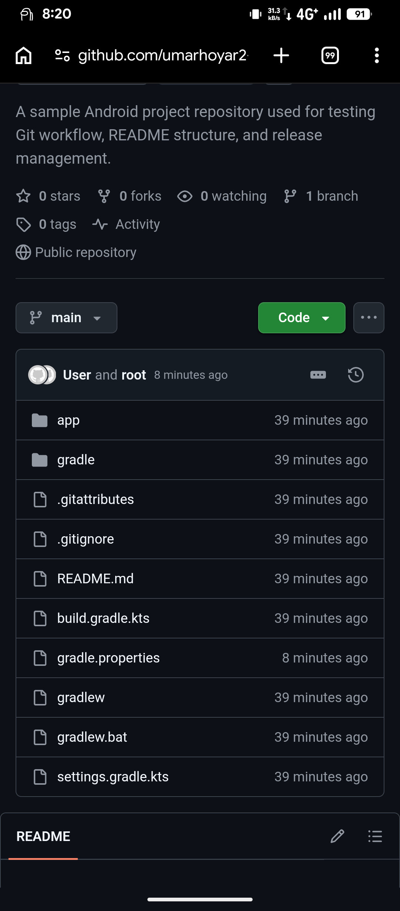
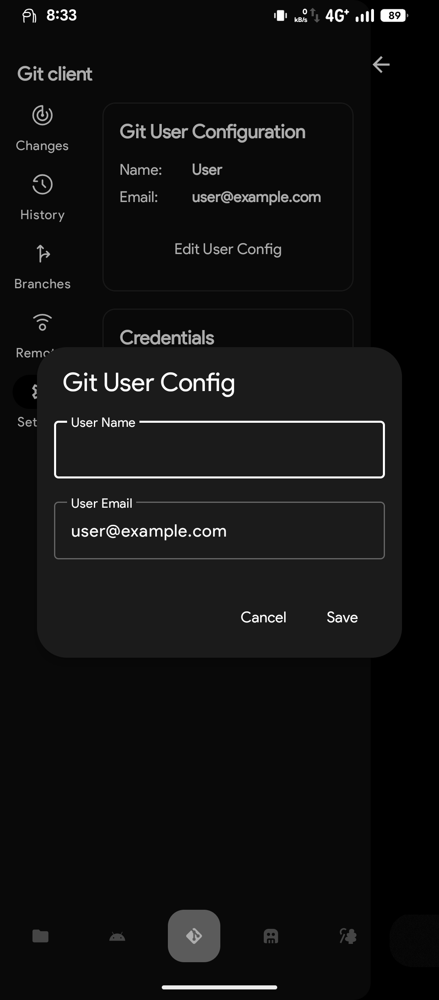

# Test Project Demo

> A sample repository built to demonstrate professional Git workflow, documentation structure, and release management.

## 📖 Overview

This repository is created to demonstrate:
- Proper Git initialization and commit workflow
- Professional README documentation structure
- APK build and release management via GitHub Releases

## ✨ Features

- Clean and organized project structure
- Well-documented codebase
- Version-controlled release management
- Easy setup and installation

## 📱 Screenshots

<table>
  <tr>
    <td></td>
    <td></td>
    <td></td>
  </tr>
</table>

## 🛠️ Tech Stack

- Language: Kotlin / Java
- IDE: Android Studio / Android Code Studio
- Build Tool: Gradle
- Version Control: Git & GitHub

## 📥 Installation

Clone the repository using this command: git clone https://github.com/umarhoyar2-max/test-project-demo.git

Then:
1. Open the project in Android Studio or Android Code Studio
2. Let Gradle sync complete
3. Run the app on an emulator or physical device

## 📲 Download APK

The latest APK build is available on the Releases page: https://github.com/umarhoyar2-max/test-project-demo/releases

## 🤝 Contributing

Contributions are welcome! To contribute:

1. Fork this repository
2. Create your feature branch
3. Commit your changes
4. Push to your branch
5. Open a Pull Request

## 📄 License

This project is licensed under the MIT License — see the LICENSE file for details.

## 👤 Author

Umar
GitHub: https://github.com/umarhoyar2-max

---
⭐ If you find this project useful, consider giving it a star!